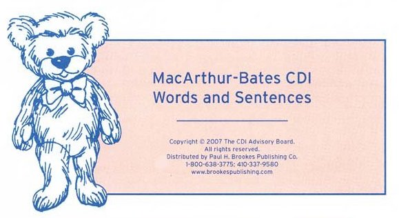

```{r io_morph_results, include=FALSE}
knitr::purl("../morph_results.Rmd")
source("../morph_results.R", chdir = TRUE)

best_coefs %<>% filter(!str_detect(language, "Aus"))
best_models %<>% filter(!str_detect(language, "Aus"))
best_models_mse %<>% filter(!str_detect(language, "Aus"))
demo_predictions_age %<>% filter(!str_detect(language, "Aus"))
kid_info %<>% filter(!str_detect(language, "Aus"))
model_comparison %<>% filter(!str_detect(language, "Aus"))
morph_measures %<>% filter(!str_detect(language, "Aus"))
plot_coefs %<>% filter(!str_detect(language, "Aus"))
```

```{r io_setup, include=FALSE}
theme_update(plot.margin = margin(3, 3, 3, 3, "pt"),
             legend.margin = margin(0, 0, 0, 0, "pt"))
measure_palette <- .pal(3) %>% set_names(levels(morph_measures$measure_print))

label_caps <- as_labeller(function(value) {
  paste0(toupper(substr(value, 1, 1)), substr(value, 2, nchar(value))) %>%
    str_replace_all("_", " ")
})

options(DT.options = list(searching = FALSE, lengthChange = FALSE))
dt <- function(data, cnames = label_caps(colnames(data)), ...) {
  DT::datatable(
    data = data,
    rownames = FALSE,
    colnames = cnames,
    ...
  )
}

vocab_age_title <- "Vocabulary or age?"
fixed_effects_title <- "Vocabulary and age"
item_effects_title <- "Individual verbs"
```


## {.build}

<div class="notes">
One of the challenges facing children as they learn language is how and when to generalize beyond the input that they've heard, without overgeneralizing.

For example, you've learned that one of these is called a "dog", and multiple of them are called "dogs". You can guess that if I tell you that one of these is called a "wug", multiple of them are called... "wugs"!
</div>


<div class="demo-img-tl">

</div>
<div class="demo-txt demo-txt-tl">
dog
</div>

<div class="demo-img-tr">


</div>
<div class="demo-txt demo-txt-tr">
dogs
</div>

<div class="demo-img-bl">

</div>
<div class="demo-txt demo-txt-bl">
wug
</div>

<div class="demo-img-br">


</div>
<div class="demo-txt demo-txt-br">
wugs
</div>


## {.build}

<div class="notes">
AND if I tell you that one of these is called a "toose", you'll guess that multiple of them are called... "tooses" (hopefully).

But, you've also learned that one of these is called a "goose", and multiple of them are called "geese".

So there are some patterns that you generalize, and some that you don't.
</div>


<div class="demo-img-tl">

</div>
<div class="demo-txt demo-txt-tl">
toose
</div>

<div class="demo-img-tr">


</div>
<div class="demo-txt demo-txt-tr">
tooses
</div>

<div class="demo-img-bl">

</div>
<div class="demo-txt demo-txt-bl">
goose
</div>

<div class="demo-img-br">


</div>
<div class="demo-txt demo-txt-br">
geese
</div>


## Background {.build}

<div class="notes">
A central question becomes – how does a child learning language figure out when to generalize a pattern or form some sort of productive rule, and when not to? Crucially, children don't get an explicit specification of these sorts of rules, and have to infer them from rather sparse input.

Decades of debate about these questions has focused on the English past tense, with a dichotomy between a having a single, non-symbolic learning mechanism for both rules and exceptions, or having a separate, symbolic mechanism for rules. The relationship between vocabulary and morphology plays an important role as evidence in these debates. If children generalize directly from their vocabularies on an item-by-item basis, we would expect continuity between vocabulary and morphology. If children form global rules from independent criteria, we would expect them to not be correlated.

We're of course not going to immediately resolve these long-standing questions. Rather, our approach is to use large-scale data to layout the empirical landscape of the relationships among morphological development, vocabulary growth, and age, generalizing to at least a few languages.
</div>

How do children learn generalizations and exceptions?

- Past-tense debate:
  - symbolic rules or connectionist networks?
  - dual-mechanism or single-mechanism?
- Relationship between vocabulary and morphology as evidence
  - Marchman 1992: continuity between vocabulary and morphology
  - Marcus 1992: "overregularization does not correlate with [...] children's vocabularies"
  
Our approach:

- Empirical landscape of vocabulary `r emo::ji('left_right_arrow')` morphology `r emo::ji('left_right_arrow')` age
- Generalization across (at least a few) languages


## Roadmap {.build}

<div class="notes">
In the rest of this talk, I'm going to first tell you about the datasets we use to build this picture, and then go into three questions that our analyses try to address:
</div>

1. Is morphology learning driven more by vocabulary __or__ by age?
2. __How__ does morphology learning depend on vocabulary __and__ age?
3. How does morphology learning differ for different verbs?


## Data {.build}

<div class="notes">
What sort of data do we need to answer these questions? We need to have, for a large set of children, a measure of their vocabulary sizes and morphological abilities. We can get these using the CDI -- as you probably know, CDIs are a family of standardized parent report checklists that have been adapted to many languages. The vocabulary portion of the CDI includes a number of verbs, and the later portion of the CDI includes some correct past tense forms of irregular verbs and some overregularized forms. We use data from Wordbank, a large open repository of CDI data, pulling out the data for the three languages that currently have morphology data: Danish, English, and Norwegian.
</div>



- "Action Words" → verbs (__go__)
- "Word Endings" → correct past tense forms of irregular verbs (__went__)
- "Word Forms" → overregularizations (__goed__, __wented__)

<br>

- Danish
- English
- Norwegian

## Data {.build}

<div class="notes">
From these datasets, we take...
</div>

- Children who inflect at least one item
- Items that have all three of stem, correct form, overregularized form(s)
- Code each child on each item as:
    - stem only (says __go__, doesn't say __went/goed/wented__)
    - stem + correct (says __go__ and __went__, doesn't say __goed/wented__)
    - stem + overregularized (says __go__ and __goed/wented__)
- Also each child's number of verbs producing and age (16--36 months)

```{r samples, cache=FALSE}
sample_sizes <- morph_measures %>%
  distinct(language, data_id, stem) %>%
  group_by(language, stem) %>%
  count(name = "num_kids") %>%
  group_by(language, num_kids) %>%
  count(name = "num_stems") %>%
  ungroup()
sample_sizes %<>% filter(!str_detect(language, "Aus"))

sample_sizes %>%
  mutate(language = language %>% fct_recode("English" = "English (American)")) %>%
  arrange(language) %>%
  dt(options = list(dom = "t", ordering = FALSE), escape = FALSE,
     class = "cell-border", cnames = c("Language", "Children", "Items"),
     width = "50%")
```


<!-- SLIDE: data densities -->

## Data {.flexbox .vcenter}

```{r density_plot}
scale_x_01 <- scale_x_continuous(
  limits = c(0, 1), expand = c(0, 0),
  breaks = seq(0, 1, 0.25), labels = as.character(seq(0, 1, 0.25))
)
scale_y_01 <- scale_y_continuous(
  limits = c(0, 1), expand = c(0, 0),
  breaks = seq(0, 1, 0.25), labels = as.character(seq(0, 1, 0.25))
)

morph_measures %<>%
  mutate(language_print = language_print %>% fct_drop() %>%
           fct_recode("English" = "English (American)") %>%
           fct_relevel("Danish", "English"))

density_plot_base <- morph_measures %>%
  ggplot(aes(x = verbs_prop, y = as.numeric(value),
             fill = interaction(value, measure_print))) +
  facet_grid(measure_print ~ language_print, drop = TRUE) +
  coord_fixed() +
  scale_x_01 + scale_y_01 +
  scale_fill_manual(values = unlist(map(.pal(3), ~c("white", .))),
                    guide = FALSE) +
  labs(x = "Verb vocabulary (proportion of items)",
       y = "Conditional density of production") +
  theme(panel.border = element_blank(),
        axis.line = element_line(size = 0.5, colour = "grey20"),
        strip.text = element_text(face = "bold"),
        strip.text.y = element_text(size = rel(0.9)),
        panel.spacing = unit(11, "pt"))
        # axis.text.x = element_text(hjust = "inward"),
        # axis.text.y = element_text(vjust = "inward"))

density_plot <- function(languages = unique(morph_measures$language),
                         measures = unique(morph_measures$measure),
                         show_data = TRUE) {
  if (!show_data) return(density_plot_base)
  morph_subset <- morph_measures %>%
    filter(language %in% languages, measure %in% measures)
  density_plot_base +
    geom_density(aes(y = ..count..), position = "fill", colour = "white",#outline.type = "full",
                 data = morph_subset)
}

density_width <- 8
density_height <- 5.75
```

<div class="notes">
First, I'm just going to give you an idea of the overall shape of the data. On the x axis we have the proportion of verbs each child produces, and we're going to see the density of how many children produce stem only, stem + correct, and stem + overregularized. As you can see, stem only first increases and then decreases. correct inflection continuously increases, and  overregularization increases but with much lower overall rates than correct inflection. The shape of the stem only trajectories is probably artifactual here, since children are running out of items on the form to not be inflecting yet, so we're going to focus on the other two measures (but I have parallel results for it if you'd like to see them later).
</div>

```{r density_base, dependson="density_plot", fig.width=density_width, fig.height=density_height}
density_plot(show_data = FALSE)
```

## Data {.flexbox .vcenter}

```{r density_lang_so, dependson="density_plot", fig.width=density_width, fig.height=density_height}
density_plot("Danish", "stem_only")
```

## Data {.flexbox .vcenter}

<div class="notes">
As you can see, stem only first increases and then decreases.
</div>

```{r density_so, dependson="density_plot", fig.width=density_width, fig.height=density_height}
density_plot(measures = "stem_only")
```

## Data {.flexbox .vcenter}

```{r density_so_sc, dependson="density_plot", fig.width=density_width, fig.height=density_height}
density_plot(measures = c("stem_only", "stem_correct"))
```

## Data {.flexbox .vcenter}

<div class="notes">
Correct inflection continuously increases, and overregularization increases but with much lower overall rates than correct inflection. The shape of the stem only trajectories is probably artifactual here, since children are running out of items on the form to not be inflecting yet, so we're going to focus on the other two measures (but I have parallel results for it if you'd like to see them later).
</div>

```{r density_so_sc_sov, dependson="density_plot", fig.width=density_width, fig.height=density_height}
density_plot()
```

## `r vocab_age_title` {.build}

<div class="notes">
The first question we want address with these datasets is whether morphology is driven more by vocabulary or by age. To examine this, for each language and measure, we fit two different mixed-effect logistic regressions, predicting whether each child inflects or overregularizes just from age or just from verb vocabulary size. We then compare the two models on robust their predictions are, and how much of the variance they explain. We computef sample prediction error -- we fit each model to data from 90% of the children and see what proportion of the remaining 10% it classifies correctly, and then average that over then ten different testing buckets.
</div>


For each language:

- `stem + correct ~ age`, `stem + overregularized ~ age`
- `stem + correct ~ verbs`, `stem + overregularized ~ verbs`


<!-- SLIDE: vocab/age model comparison -->

```{r model_comp_plot}
breaker <- function(by) {
  function(limits) {
    low <- floor(limits[1]/by)*by
    high <- ceiling(limits[2]/by)*by
    seq(low, high, by)
  }
}

limiter <- function(by) {
  function(limits) {
    low <- floor(limits[1]/by)*by
    high <- ceiling(limits[2]/by)*by
    c(low, high)
  }
}

labeller_point <- function(breaks) {
  sprintf("%.2f", breaks) %>% str_remove("^0")
}

model_comparison %<>%
  filter(formula_print %in% c("age", "verbs"),
         measure != "stem_only") %>%
  mutate(measure_print = fct_drop(measure_print),
         language_print = language_print %>% fct_drop() %>%
           fct_recode("English" = "English (American)") %>%
           fct_relevel("Danish", "English"))

model_comp_plot <- function(languages = unique(model_comparison$language),
                            measures = unique(model_comparison$measure),
                            metric, metric_label, by = 0.02,
                            no_strips = FALSE,
                            circle = FALSE,
                            show_data = TRUE) {
  metric <- enquo(metric)

  model_comp_lang <- model_comparison %>% filter(language %in% languages)
  model_best <- model_comp_lang %>%
    group_by(language, measure) %>%
    filter(mean_mse == min(mean_mse))
  model_comp_base <- model_comparison %>%
    ggplot(aes(x = !!metric, y = fct_rev(formula_print), colour = measure_print)) +
      facet_grid(language_print ~ measure_print, scales = "free_x", switch = "y",
                 drop = FALSE) +
      scale_colour_manual(guide = FALSE, values = measure_palette) +
      scale_x_continuous(limits = limiter(by), breaks = breaker(by),
                         labels = labeller_point) +
      labs(x = metric_label, y = "") +
      theme(panel.grid.major.y = .coef_line,
            panel.border = element_blank(),
            axis.line.x = element_line(),
            axis.ticks.y = element_blank(),
            strip.text = element_text(face = "bold"),
            strip.text.y = element_text(size = rel(0.85)),
            strip.placement = "outside",
            panel.spacing.x = unit(22, "pt"),
            plot.margin = margin())
  
  if (no_strips) model_comp_base <- model_comp_base +
    theme(strip.text.x = element_blank())
  
  if (!show_data) return(model_comp_base)
  base_plus_data <- model_comp_base +
    geom_point(data = model_comp_lang %>% filter(measure %in% measures),
               size = 3) +
    geom_point(data = model_comparison, alpha = 0, size = 3)
  if (!circle) return(base_plus_data)
  base_plus_data +
    geom_point(size = 6, colour = "black", shape = 21,
               data = model_best %>%
                 filter(language %in% languages, measure %in% measures))
}

model_comp_mse <- partial(model_comp_plot, metric = 1 - mean_mse,
                          metric_label = "1 - (mean squared prediction error)")
model_comp_rsq <- partial(model_comp_plot, metric = rsq, metric_label = "r²",
                          by = 0.04, no_strips = TRUE)

comp_height <- 2.9
comp_width <- 6
```

## `r vocab_age_title` {.build}

<div class="notes">
For each of the languages and measure, I'm going to show you 1 minus this mean squared predictive error (so that bigger is better), and the proportion of variance explained by the model.
</div>

```{r, dependson="model_comp_plot", fig.width=comp_width, fig.height=comp_height}
model_comp_mse(show_data = FALSE)
```
```{r, dependson="model_comp_plot", fig.width=comp_width, fig.height=.9*comp_height}
model_comp_rsq(show_data = FALSE)
```

## `r vocab_age_title`

```{r, dependson="model_comp_plot", fig.width=comp_width, fig.height=comp_height}
model_comp_mse("Danish", "stem_correct")
```
```{r, dependson="model_comp_plot", fig.width=comp_width, fig.height=.9*comp_height}
model_comp_rsq("Danish", "stem_correct")
```

## `r vocab_age_title`

```{r, dependson="model_comp_plot", fig.width=comp_width, fig.height=comp_height}
model_comp_mse(measures = "stem_correct")
```
```{r, dependson="model_comp_plot", fig.width=comp_width, fig.height=.9*comp_height}
model_comp_rsq(measures = "stem_correct")
```

## `r vocab_age_title`

```{r, dependson="model_comp_plot", fig.width=comp_width, fig.height=comp_height}
model_comp_mse()
```
```{r, dependson="model_comp_plot", fig.width=comp_width, fig.height=.9*comp_height}
model_comp_rsq()
```

## `r vocab_age_title`

```{r, dependson="model_comp_plot", fig.width=comp_width, fig.height=comp_height}
model_comp_mse(circle = TRUE)
```
```{r, dependson="model_comp_plot", fig.width=comp_width, fig.height=.9*comp_height}
model_comp_rsq(circle = TRUE)
```

## `r vocab_age_title`

```{r, dependson="model_comp_plot", fig.width=comp_width, fig.height=comp_height}
model_comp_mse(circle = TRUE)
```
```{r, dependson="model_comp_plot", fig.width=comp_width, fig.height=.9*comp_height}
model_comp_rsq(circle = TRUE)
```

<div class="popout" style="position: absolute; top: 250px; right: 60px; width: 30%;">
Morphology learning is more strongly related to vocabulary 
size than to age
</div>

## `r fixed_effects_title` {.build}

<div class="notes">
Moving beyong a binary decision between vocabulary and age, we want to see how both of them affect morphology when considered together. So we again fit mixed-effects logistics regressions that allow us to examine these relationships in more detail... (and note that this complex model is justified by the same cross-validation method described previously compared to each reasonable subset of predictors).

For each of stem + correct and stem + overreg, I'm going to show you first the verb effects and then the age effects.
</div>

For each language and measure:

`says ~` <span style="float:right;">how does morphology learning...</span>

`verbs + verbs² +` <span style="float:right;">depend on vocabulary size?</span>

`age + age & verbs + age & verbs² +` <span style="float:right;">change with age?</span>

`(1 + verbs + age | item)` <span style="float:right;">differ for different verbs?</span>


```{r demo_plots}
# best_coefs <- read_feather("data/best_models/best_coefs.feather")
all_coefs <- read_feather("../data/fits/intercepts/inflecting/all_coefs.feather")
all_coefs %<>% filter(!str_detect(language, "Aus"))

plot_coefs <- all_coefs %>%
  mutate(#significant = if_else(p.value < 0.05, "*", ""),
         language_print = format_languages(language),
         term_print = format_terms(term) %>% fct_rev(),
         ci_upper = estimate + 1.96 * std.error,
         ci_lower = estimate - 1.96 * std.error) %>%
  filter(term != "(Intercept)") %>%#, dataset == "inflecting")
  mutate(language_print = language_print %>%
           fct_recode("English" = "English (American)") %>%
           fct_relevel("Danish", "English"))

main_coefs <- plot_coefs %>%
  filter(formula == "age + verbs_prop + verbs_prop^2 + (1 | stem)")
int_coefs <- plot_coefs %>%
  filter(formula == "age * verbs_prop + age * verbs_prop^2 + (1 | stem)")

demo_predictions_age <- read_feather("../data/demo/demo_predictions_age.feather") %>%
  filter(!str_detect(language, "Aus"), dataset == "inflecting") %>%
  mutate(age_print = as.character(age), #paste(age, "mos"),
         language_print = format_languages(language),
         measure_print = format_measures(measure)) %>%
  mutate(language_print = language_print %>%
           fct_recode("English" = "English (American)") %>%
           fct_relevel("Danish", "English"))

plot_demo_coefs <- function(meas, effect = "age", show_data = TRUE) {
  
  if (effect == "verbs") measure_coefs <- main_coefs %>%
      filter(measure == meas, str_detect(term, "verb"))
  else if (effect == "age") measure_coefs <- bind_rows(
    main_coefs %>% filter(measure == meas, str_detect(term, "age")),
    int_coefs %>% filter(measure == meas, str_detect(term, "age &"))
  )
  
  # measure_coefs <- plot_coefs %>% filter(measure == meas)
  # if (effect == "main") measure_coefs %<>%
  #   filter(str_detect(term, "verb"), str_detect(term, "&", negate = TRUE))
  # else measure_coefs %<>% filter(str_detect(term, "age"))

  coef_plot <- measure_coefs %>%
    ggplot(aes(x = estimate, y = term_print, xmin = ci_lower, xmax = ci_upper)) +
    facet_grid(. ~ language_print) +
    geom_vline(xintercept = 0, linetype = .refline, colour = .grey) +
    # scale_x_continuous(breaks = coef_breaks, labels = coef_labels) +
    labs(x = "Coefficient estimate (log odds ratio)", y = "") +
    theme(panel.border = element_blank(),
          axis.line.x = element_line(size = 0.5, colour = "grey20"),
          axis.ticks.y = element_blank(),
          strip.text = element_text(face = "bold"),
          panel.grid.major.y = .coef_line,
          panel.spacing.x = unit(16.5, "pt"))
  
  if (!show_data) coef_plot + geom_pointrangeh(alpha = 0)
  else coef_plot + geom_pointrangeh()
  
}

plot_demo_fits <- function(meas, effect = "age", show_data = TRUE) {
  
  measure_age_fits <- demo_predictions_age %>% filter(measure == meas)
  response_range <- range(measure_age_fits$.response)
  if (effect == "verbs") measure_age_fits %<>% filter(age == min(age))
  
  measure_label <- meas %>% str_replace("_", " + ") %>%
    str_replace("overreg", "overregularized")

  fit_plot <- measure_age_fits %>%
    ggplot(aes(x = verbs, y = .response, colour = age_print)) +
    facet_grid(. ~ language_print, scales = "free_y") +
    expand_limits(x = 120) +
    scale_x_continuous(breaks = c(10, 40, 70, 100)) +
    ylim(response_range) +
    .scale_colour_discrete(guide = FALSE) +
    labs(x = "Verb vocabulary size", y = glue("Probability of\n {measure_label}")) +
    # geom_rangeframe(colour = "grey20", size = 0.8) +
    theme(panel.border = element_blank(),
          axis.line = element_line(size = 0.5, colour = "grey20"),
          strip.text = element_text(face = "bold"),
          panel.spacing.x = unit(16.5, "pt"))
  
  if (!show_data) fit_plot + geom_line(alpha = 0)
  else fit_plot + geom_line() +
    geom_dl(aes(label = age_print),
            method = list("last.qp", dl.trans(x = x + 0.15),
                          fontfamily = .font, cex = 0.9))
  
}

demo_coefs_width <- 8
demo_coefs_height <- 1.75
demo_fits_width <- 8
demo_fits_height <- 2.75
```

```{r}
# demo_predictions_age %>%
#   filter(language_print == "Danish", measure == "stem_overreg",
#          age == min(age)) %>%
#   mutate(.response = 100 * round(.response, 3)) %>%
#   select(verbs, .response) %>%
#   mutate(diff = .response - lag(.response, 10)) %>%
#   View

# 20 verbs = 5% inflecting
# 30 verbs = 7% inflecting
# 40 verbs = 9% inflecting
# 50 verbs = 12.5% inflecting
# 60 verbs = 17% inflecting
# 70 verbs = 23% inflecting
# 80 verbs = 30% inflecting
# 90 verbs = 40% inflecting
# 100 verbs = 50% inflecting

# A child who knows 20 verbs has roughly a 5% change of correctly inflecting any one item, while a child who knows 80 verbs has a 30% chance. And at 20 verbs, learning another 10 raises the chance of correctly inflecting 2 percentage points, while at 80 verbs, learning another 10 verbs raises the chance by 10 percentage points.

# overreg
# 20 = 1.5%
# 30 = 2%
# 40 = 3%
# 80 = 11%
# 90 = 14% 

# A child who knows 20 verbs has roughly a 1.5% change of overregularizing any one item, while a child who knows 80 verbs has an 11% chance. And at 20 verbs, learning another 10 raises the chance of correctly inflecting by half of a percentage point, while at 80 verbs, learning another 10 verbs raises the chance by 3 percentage points.

# demo_predictions_age %>%
#   filter(measure == "stem_overreg", language_print == "Danish") %>%
#   select(language_print, age, verbs, .response) %>%
#   mutate(.response = 100 * round(.response, 3)) %>%
#   pivot_wider(names_from = age, values_from = .response) %>%
#   mutate(diff = `30` - `24`) %>%
#   filter(verbs %in% c(20, 30, 80, 90)) %>%
  # View

# inflect
# 20 verbs: 24 5%, 30 6%
# 80 verbs: 24 30%, 30 34%

# And at 20 verbs, learning another 10 raises the chance of correctly inflecting 2 percentage points, while at 80 verbs, learning another 10 verbs raises the chance by 10 percentage points.


# overreg @ 70:
# eng: 24 8%, 30 11%
# dan: 24 11%, 30 14%
# nor: 24 7%, 30 10%
```


<!-- SLIDE: stem+correct vocab effects -->

## `r fixed_effects_title`

__stem + correct__: says __go__ and __went__, doesn't say __goed/wented__

```{r, dependson="demo_plots", fig.height=demo_fits_height, fig.width=demo_fits_width}
plot_demo_fits("stem_correct", "verbs", show_data = FALSE)
```

## `r fixed_effects_title`

__stem + correct__: says __go__ and __went__, doesn't say __goed/wented__

```{r, dependson="demo_plots", fig.height=demo_fits_height, fig.width=demo_fits_width}
plot_demo_fits("stem_correct", "verbs")
```

## `r fixed_effects_title`

__stem + correct__: says __go__ and __went__, doesn't say __goed/wented__

```{r, dependson="demo_plots", fig.height=demo_fits_height, fig.width=demo_fits_width}
plot_demo_fits("stem_correct", "verbs")
```

```{r, dependson="demo_plots", fig.height=demo_coefs_height, fig.width=demo_coefs_width}
plot_demo_coefs("stem_correct", "verbs", show_data = FALSE)
```

## `r fixed_effects_title`

__stem + correct__: says __go__ and __went__, doesn't say __goed/wented__

```{r, dependson="demo_plots", fig.height=demo_fits_height, fig.width=demo_fits_width}
plot_demo_fits("stem_correct", "verbs")
```

```{r, dependson="demo_plots", fig.height=demo_coefs_height, fig.width=demo_coefs_width}
plot_demo_coefs("stem_correct", "verbs")
```

<div class="notes">
Positive linear effects of verb vocabulary: more verbs means more likely to produce stem + correct.

A 24-month-old English learning child who knows 20 verbs has roughly a 5% change of correctly inflecting any one item, while a child who knows 80 verbs has a 30% chance.

Positive quadratic effect of verb vocabulary: the more verbs, the more the number of verbs increases probability of producing stem + correct.

At 20 verbs, learning another 10 verbs raises the chance of correctly inflecting by only 2 percentage points, while at 80 verbs, learning another 10 verbs raises the chance by 10 percentage points.
</div>


<!-- SLIDE: stem+correct age effects -->

## `r fixed_effects_title`

__stem + correct__: says __go__ and __went__, doesn't say __goed/wented__

```{r, dependson="demo_plots", fig.height=demo_fits_height, fig.width=demo_fits_width}
plot_demo_fits("stem_correct")
```

## `r fixed_effects_title`

__stem + correct__: says __go__ and __went__, doesn't say __goed/wented__

```{r, dependson="demo_plots", fig.height=demo_fits_height, fig.width=demo_fits_width}
plot_demo_fits("stem_correct")
```

```{r, dependson="demo_plots", fig.height=demo_coefs_height, fig.width=demo_coefs_width}
plot_demo_coefs("stem_correct", show_data = FALSE)
```

## `r fixed_effects_title`

__stem + correct__: says __go__ and __went__, doesn't say __goed/wented__

```{r, dependson="demo_plots", fig.height=demo_fits_height, fig.width=demo_fits_width}
plot_demo_fits("stem_correct")
```

```{r, dependson="demo_plots", fig.height=demo_coefs_height, fig.width=demo_coefs_width}
plot_demo_coefs("stem_correct")
```

<div class="notes">
Positive effects of age: older children more likely produce stem + correct, even controlling for vocabulary size.

A 24-month old who knows 80 verbs has a 30% chance of correctly inflecting, while a 30 month old has 34% chance.

Negative interactions between age and linear verb vocabulary: larger effect of verb vocabulary for younger children, though its bigger for smallest and largest vocabularies.

At 20 verbs: 24 month old has 5% of correct, 30 month old has 6% chance
in middle range same chance
At 80 verbs: 24 30%, 30 34%
</div>


<!---------------------------------------------------------------------------->
<!-- SLIDE: stem+overreg vocab effects -->
<!---------------------------------------------------------------------------->

## `r fixed_effects_title`

__stem + overregularized__: says __go__ and __goed/wented__

```{r, dependson="demo_plots", fig.height=demo_fits_height, fig.width=demo_fits_width}
plot_demo_fits("stem_overreg", "verbs", show_data = FALSE)
```

## `r fixed_effects_title`

__stem + overregularized__: says __go__ and __goed/wented__

```{r, dependson="demo_plots", fig.height=demo_fits_height, fig.width=demo_fits_width}
plot_demo_fits("stem_overreg", "verbs")
```

## `r fixed_effects_title`

__stem + overregularized__: says __go__ and __goed/wented__

```{r, dependson="demo_plots", fig.height=demo_fits_height, fig.width=demo_fits_width}
plot_demo_fits("stem_overreg", "verbs")
```

```{r, dependson="demo_plots", fig.height=demo_coefs_height, fig.width=demo_coefs_width}
plot_demo_coefs("stem_overreg", "verbs", show_data = FALSE)
```

## `r fixed_effects_title`

__stem + overregularized__: says __go__ and __goed/wented__

```{r, dependson="demo_plots", fig.height=demo_fits_height, fig.width=demo_fits_width}
plot_demo_fits("stem_overreg", "verbs")
```

```{r, dependson="demo_plots", fig.height=demo_coefs_height, fig.width=demo_coefs_width}
plot_demo_coefs("stem_overreg", "verbs")
```

<div class="notes">
Positive linear effects of verb vocabulary: more verbs means more likely to produce stem + overregularized.

A 24-month-old English learning child who knows 20 verbs has roughly a 1,5% change of overregularizing any one item, while a child who knows 80 verbs has an 11% chance.

Negative quadratic effect of verb vocabulary: effect of verb vocabulary decreases with verb vocabulary.

And at 20 verbs, learning another 10 raises the chance of correctly inflecting by only half of a percentage point, while at 80 verbs, learning another 10 verbs raises the chance by 3 percentage points.
</div>

<!-- SLIDE: stem+overreg age effects -->

## `r fixed_effects_title`

__stem + overregularized__: says __go__ and __goed/wented__

```{r, dependson="demo_plots", fig.height=demo_fits_height, fig.width=demo_fits_width}
plot_demo_fits("stem_overreg")
```

## `r fixed_effects_title`

__stem + overregularized__: says __go__ and __goed/wented__

```{r, dependson="demo_plots", fig.height=demo_fits_height, fig.width=demo_fits_width}
plot_demo_fits("stem_overreg")
```

```{r, dependson="demo_plots", fig.height=demo_coefs_height, fig.width=demo_coefs_width}
plot_demo_coefs("stem_overreg", show_data = FALSE)
```

## `r fixed_effects_title`

<div class="notes">
Positive effects of age: older children more likely produce stem + overregularized.
American English has weird noisy stuff happening at the end of the range.

overreg @ 70:
eng: 24 8%, 30 11%
dan: 24 11%, 30 14%
nor: 24 7%, 30 10%
</div>

__stem + overregularized__: says __go__ and __goed/wented__

```{r, dependson="demo_plots", fig.height=demo_fits_height, fig.width=demo_fits_width}
plot_demo_fits("stem_overreg")
```

```{r, dependson="demo_plots", fig.height=demo_coefs_height, fig.width=demo_coefs_width}
plot_demo_coefs("stem_overreg")
```


```{r stem_fits_plot}
demo_predictions_slopes_stem <- read_feather("../data/demo/demo_predictions_slopes_stem.feather") %>%
  select(language, measure, age, verbs, stem, .response) %>%
  mutate(age_print = as.character(age),
         language_print = format_languages(language),
         measure_print = format_measures(measure))
demo_predictions_slopes_stem %<>%
  filter(!str_detect(language, "Aus"), age %in% c(24, 30))

demo_predictions_slopes_means <- demo_predictions_slopes_stem %>%
  group_by(language, language_print, measure, measure_print, age, age_print, verbs) %>%
  summarise(.response = mean(.response)) %>%
  ungroup()

plot_stem_fits <- function(lang, measures, ages, stems, show_stems = TRUE) {
  
  measure_label <- measures %>% str_replace("_", " + ") %>%
    str_replace("overreg", "overregularized")
  
  measure_means <- demo_predictions_slopes_means %>%
    filter(language == lang, measure %in% measures, age %in% ages)
  measure_fits <- demo_predictions_slopes_stem %>%
    filter(language == lang, measure %in% measures, age %in% ages, stem %in% stems)

  response_range <- range(measure_fits$.response)

  fits_plot <- ggplot(measure_fits, aes(x = verbs, y = .response)) +
    # expand_limits(x = 125, x = -10) +
    geom_line(aes(group = age_print), colour = "black", data = measure_means) +
    geom_dl(aes(label = age_print), data = measure_means,
            method = list("last.qp", dl.trans(x = x + 0.15),
                          fontfamily = .font, cex = 0.9)) +
    scale_x_continuous(breaks = c(10, 40, 70, 100), limits = c(-15, 110)) +
    ylim(response_range) +
    .scale_colour_discrete(guide = FALSE) +
    labs(x = "Verb vocabulary size", y = glue("Probability of\n {measure_label}")) +
    theme(panel.border = element_blank(),
          axis.line = element_line(size = 0.5, colour = "grey20"),
          strip.text = element_text(face = "bold"),
          panel.spacing.x = unit(16.5, "pt"),
          plot.margin = margin(5.5, 22, 22, 5.5))
  
  if (show_stems) fits_plot +
    geom_line(aes(colour = age_print, group = interaction(stem, age_print)),
              data = measure_fits) +
    geom_dl(aes(label = stem), data = measure_fits,
            method = list("first.qp", dl.trans(x = x - 0.15),
                          fontfamily = .font, cex = 0.9))
  else fits_plot
}

demo_ages <- unique(demo_predictions_slopes_stem$age)

stem_fits_width <- 4
stem_fits_height <- 2.75
```


<!-- SLIDE: item effects illustration -->

## `r item_effects_title`

<div class="notes">
All of the effects so have been chances of inflecting or overegularizing any given item, but how do specific verbs differ? This is encoded in the random effects, which we can use to get some insight into how inflecting and overregularization compare to one another.
</div>

```{r, dependson="stem_fits_plot", fig.width=stem_fits_width, fig.height=stem_fits_height}
plot_stem_fits("English (American)", "stem_correct", 24, c("break", "hear"), FALSE)
```

## `r item_effects_title`

<div class="notes">
To illustrate, from the model fits, there's some overall trajectory for 24 month olds, and there's trajectories for the individual verbs -- "hear" is less likely to be correctly inflected than average, while "break" is more likely to be.
</div>

```{r, dependson="stem_fits_plot", fig.width=stem_fits_width, fig.height=stem_fits_height}
plot_stem_fits("English (American)", "stem_correct", 24, c("break", "hear"))
```

## `r item_effects_title`

```{r, dependson="stem_fits_plot", fig.width=stem_fits_width, fig.height=stem_fits_height}
plot_stem_fits("English (American)", "stem_correct", 24, c("break", "hear"))
plot_stem_fits("English (American)", "stem_correct", demo_ages, c("break", "hear"), FALSE)
```

## `r item_effects_title`

<div class="notes">
Similarly, there's some overall difference by age, but some verbs have a larger effect than others.
</div>

```{r, dependson="stem_fits_plot", fig.width=stem_fits_width, fig.height=stem_fits_height}
plot_stem_fits("English (American)", "stem_correct", 24, c("break", "hear"))
plot_stem_fits("English (American)", "stem_correct", demo_ages, c("break", "hear"))
```

## `r item_effects_title`

```{r, dependson="stem_fits_plot", fig.width=stem_fits_width, fig.height=stem_fits_height}
plot_stem_fits("English (American)", "stem_correct", 24, c("break", "hear"))
plot_stem_fits("English (American)", "stem_correct", demo_ages, c("break", "hear"))
plot_stem_fits("English (American)", "stem_overreg", 24, c("break", "hear"), FALSE)
plot_stem_fits("English (American)", "stem_overreg", demo_ages, c("break", "hear"), FALSE)
```

## `r item_effects_title`

<div class="notes">
"Hear" is also less likely than average to get overregularized while "break" is more likely, but "hear" has a larger age effect than average for correct inflection while "break" has one for overregularization.
</div>

```{r, dependson="stem_fits_plot", fig.width=stem_fits_width, fig.height=stem_fits_height}
plot_stem_fits("English (American)", "stem_correct", 24, c("break", "hear"))
plot_stem_fits("English (American)", "stem_correct", demo_ages, c("break", "hear"))
plot_stem_fits("English (American)", "stem_overreg", 24, c("break", "hear"))
plot_stem_fits("English (American)", "stem_overreg", demo_ages, c("break", "hear"))
```


```{r plot_slopes_term}
slopes_ranefs <- read_feather("../data/slopes_ranefs.feather")
slopes_ranefs %<>% filter(!str_detect(language, "Aus"))

slopes_ranefs_measure <- slopes_ranefs %>%
  select(language, measure, stem, term, estimate) %>%
  spread(measure, estimate) %>%
  mutate(language_print = format_languages(language),
         term_print = format_terms(term)) %>%
  mutate(language_print = language_print %>%
           fct_recode("English" = "English (American)") %>%
           fct_relevel("Danish", "English"))

format_cor <- function(val) {
  sprintf("%.2f", val) %>% str_replace("-", "–") %>% str_replace("0\\.", ".")
}

slopes_ranefs_measure_cors <- slopes_ranefs_measure %>%
  group_by(language, language_print, term, term_print) %>%
  summarise(cor_sc_so = cor(stem_correct, stem_overreg),
            p_sc_so = cor.test(stem_correct, stem_overreg)$p.value) %>%
  mutate(signif = if_else(p_sc_so < 0.05, "*", ""),
         cor = paste("r =", format_cor(cor_sc_so), signif))

slopes_ranefs_term <- slopes_ranefs %>%
  select(language, measure, stem, term, estimate) %>%
  spread(term, estimate) %>%
  mutate(language_print = format_languages(language),
         measure_print = format_measures(measure))

slopes_ranefs_terms_cors <- slopes_ranefs_term %>%
  group_by(language, language_print, measure, measure_print) %>%
  summarise(cor_int_age = cor(`(Intercept)`, age),
            p_int_age = cor.test(`(Intercept)`, age)$p.value,
            cor_int_verbs = cor(`(Intercept)`, verbs_prop),
            p_int_verbs = cor.test(`(Intercept)`, verbs_prop)$p.value,
            cor_verbs_age = cor(verbs_prop, age),
            p_verbs_age = cor.test(verbs_prop, age)$p.value) %>%
  gather(vars, val, starts_with("cor_"), starts_with("p_")) %>%
  separate(vars, c("var", "x", "y")) %>%
  spread(var, val) %>%
  mutate(signif = if_else(p < 0.05, "*", ""),
         cor = paste("r =", format_cor(cor), signif),
         x = fct_recode(x, "(Intercept)" = "int", "verbs_prop" = "verbs"),
         y = fct_recode(y, "verbs_prop" = "verbs"))

plot_slopes_term <- function(terms, r_pos = "left", show_data = TRUE) {
  slopes_measures_term <- slopes_ranefs_measure %>% filter(term %in% terms)
  if (r_pos == "left") {
    x_pos <- min(slopes_measures_term$stem_correct)
    x_just <- 0
  }
  if (r_pos == "right") {
    x_pos <- max(slopes_measures_term$stem_correct)
    x_just <- 1
  }
  
  terms_label <- terms %>%
    fct_recode("Intercept" = "(Intercept)",
               "Age effect" = "age",
               "Verbs effect" = "verbs_prop")

  term_plot <- ggplot(slopes_measures_term, aes(x = stem_correct, y = stem_overreg)) +
    facet_grid(. ~ language_print) +
    geom_hline(yintercept = 0, linetype = .refline, colour = .grey) +
    geom_vline(xintercept = 0, linetype = .refline, colour = .grey) +
    labs(x = glue("{terms_label} for stem + correct"),
         y = glue("{terms_label} for\n stem + overregularized")) +
    theme(panel.border = element_blank(),
          axis.line = element_line(size = 0.5, colour = "grey20"),
          strip.text = element_text(face = "bold"),
          panel.spacing.x = unit(16.5, "pt"),
          plot.margin = margin(3, 5, 3, 3))


  if (!show_data) term_plot +
    geom_text(aes(label = stem), family = .font, vjust = "inward", hjust = "inward",
              alpha = 0)
  else term_plot +
    geom_smooth(method = "lm", se = FALSE, colour = .pal(1)) +
    geom_text(aes(label = stem), family = .font, vjust = "inward", hjust = "inward") +
    geom_text(aes(label = cor), family = .font, colour = "gray50",
              x = x_pos, hjust = x_just, y = max(slopes_measures_term$stem_overreg),
              data = slopes_ranefs_measure_cors %>% filter(term %in% terms))

}

slopes_term_width <- 8
slopes_term_height <- 3
```

<!-- SLIDE: item intercepts -->

## `r item_effects_title`

<div class="notes">
If we compare these effects across the two measures, we see that
</div>

```{r, dependson="plot_slopes_term", fig.width=slopes_term_width, fig.height=slopes_term_height}
plot_slopes_term("(Intercept)", show_data = FALSE)
```

## `r item_effects_title`

```{r, dependson="plot_slopes_term", fig.width=slopes_term_width, fig.height=slopes_term_height}
plot_slopes_term("(Intercept)")
```

## `r item_effects_title`

```{r, dependson="plot_slopes_term", fig.width=slopes_term_width, fig.height=slopes_term_height}
plot_slopes_term("(Intercept)")
```

<div class="popout" style="width: 72%">
Verbs that are correctly inflected __more__ are overregularized __more__
</div>

<!-- SLIDE: item vocab effects -->

## `r item_effects_title`

```{r, dependson="plot_slopes_term", fig.width=slopes_term_width, fig.height=slopes_term_height}
plot_slopes_term("verbs_prop", show_data = FALSE)
```

## `r item_effects_title`

```{r, dependson="plot_slopes_term", fig.width=slopes_term_width, fig.height=slopes_term_height}
plot_slopes_term("verbs_prop")
```

## `r item_effects_title`

```{r, dependson="plot_slopes_term", fig.width=slopes_term_width, fig.height=slopes_term_height}
plot_slopes_term("verbs_prop")
```

<div class="popout">
For verbs whose correct inflection is __more__ influenced by vocabulary size, overregularization is also __more__ influenced by vocabulary size
</div>

<!-- SLIDE: item age effects -->

## `r item_effects_title`

```{r, dependson="plot_slopes_term", fig.width=slopes_term_width, fig.height=slopes_term_height}
plot_slopes_term("age", "right", show_data = FALSE)
```

## `r item_effects_title`

```{r, dependson="plot_slopes_term", fig.width=slopes_term_width, fig.height=slopes_term_height}
plot_slopes_term("age", "right")
```

<div class="popout">
For verbs for whose correct inflection is __more__ influenced by age, overregularization (might be) __less__ influenced by age
</div>


## Takeaways {.build}

<div class="notes">
vocabulary size gives more robust predictions of morphological measures than does age (and not much less than most complex models), and has a very large effect on both inflection and overregularization

suggests morphology learning being coupled to lexical learning (or both being coupled to general language ability)

suggests that there are developmental changes that affect morphological ability over and above vocabulary

rather than evidence for a global rule, we see evidence for verb-specific competition between regular and irregular forms
</div>

- Irregular morphology learning __relates strongly__ to vocabulary learning
- This relationship is __modulated by age__: __older__ children...
  - are __more__ likely to produce correct forms and overregularize
  - are __less__ strongly driven to correct inflection by vocabulary size
- and __varies across verbs__: verbs that are correctly inflected __more__...
  - are also overregularized __more__
  - are influenced __more__ by vocabulary size and __less__ by age

<hr>
<br>

<div class="centered small">


All data and code: [github.com/mikabr/cdi-morph](https://github.com/mikabr/cdi-morph)

</div>
