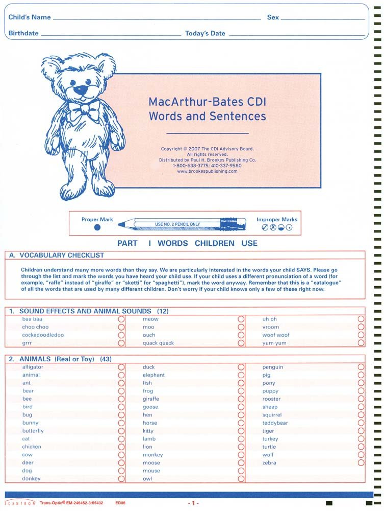

```{r io_morph_results, include=FALSE}
knitr::purl("../morph_results.Rmd")
source("../morph_results.R", chdir = TRUE)
```

```{r io_setup, include=FALSE}
theme_update(plot.margin = margin(0, 0, 0, 0, "pt"),
             legend.margin = margin(0, 0, 0, 0, "pt"))
measure_palette <- .pal(3) %>% set_names(levels(morph_measures$measure_print))

label_caps <- as_labeller(function(value) {
  paste0(toupper(substr(value, 1, 1)), substr(value, 2, nchar(value))) %>%
    str_replace_all("_", " ")
})

options(DT.options = list(searching = FALSE, lengthChange = FALSE))
dt <- function(data, cnames = label_caps(colnames(data)), ...) {
  DT::datatable(
    data = data,
    rownames = FALSE,
    colnames = cnames,
    ...
  )
}
```


## {.build}

<div class="notes">
One of the central features of language, like other complex cognitive systems, is productivity – language doesn't just consist of a stored list of things to say, but rather provides a rich system of patterns or rules that let speakers express potentially infinite meanings with finite means.

For example, you've learned that one of these is called a "dog", and multiple of them are called "dogs". You can guess that if I tell you that one of these is called a "wug", multiple of them are called... "wugs"!
</div>

<div></div>

<div class="demo-img-tl">

</div>
<div class="demo-txt demo-txt-tl">
dog
</div>

<div class="demo-img-tr">


</div>
<div class="demo-txt demo-txt-tr">
dogs
</div>

<div class="demo-img-bl">

</div>
<div class="demo-txt demo-txt-bl">
wug
</div>

<div class="demo-img-br">


</div>
<div class="demo-txt demo-txt-br">
wugs
</div>


## {.build}

<div class="notes">
AND if I tell you that one of these is called a "toose", you'll guess that multiple of them are called... "tooses" (hopefully).

But, you've also learned that one of these is called a "goose", and multiple of them are called "geese".

So there are some patterns that you generalize, and some that you don't.
</div>


<div class="demo-img-tl">

</div>
<div class="demo-txt demo-txt-tl">
toose
</div>

<div class="demo-img-tr">


</div>
<div class="demo-txt demo-txt-tr">
tooses
</div>

<div class="demo-img-bl">

</div>
<div class="demo-txt demo-txt-bl">
goose
</div>

<div class="demo-img-br">


</div>
<div class="demo-txt demo-txt-br">
geese
</div>


## Background {.build}

<div class="notes">
A central question becomes – how does a child learning language figure out when to generalize a pattern or form a productive rule, and when not to? Crucially, children don't get an explicit specification of these sorts of rules, and have to infer them from rather sparse input – how do they decide when to stick with exactly what they've heard and when to go beyond it?

One way of getting a handle on this question is seeing what kids are saying, both correct and overregularized.
</div>

How do children learn generalizations and exceptions?

- Past-tense debate:
  - symbolic rules or connectionist networks?
  - dual-mechanism or single-mechanism?
- Relationship between vocabulary and morphology as evidence
  - Marcus 1992: "overregularization does not correlate with [...] children's vocabularies"
  - Marchman 1992: continuity between vocabulary and morphology
  
Our approach:

- Empirical landscape of vocabulary `r emo::ji('left_right_arrow')` morphology `r emo::ji('left_right_arrow')` age
- Generalization across (at least a few) languages
- Warning: `r emo::ji('construction')`

## {.build}


<div class="columns-2">
<br>


<br>

Parent-report checklist<br><br>

- "Action Words" → verbs
- "Word endings" → correct inflections of irregulars
- "Word forms" → overregularizations

</div>

## {.build}

<div class="notes">
To get more data, we built Wordbank, an open repository that aggregates CDI data. Wordbank now has tens of thousands of administrations of the CDI in dozens of languages. This let's us explore questions in a consistent way across languages.
</div>

<div class="columns-2">

<div class="centered">
<br>

</div>

<br>

Open repository of CDI data<br>
[wordbank.stanford.edu](http://wordbank.stanford.edu)<br><br>

- Morphology data:
  - Danish
  - Norwegian
  - English (American)
  - English (Australian)

</div>


## Overview {.build}

How does morphology...

- change with age?
- depend on vocabulary size?
- depend on vocabulary size non-linearly?
- depend on vocabulary size differently at different ages?
- differ for different verbs?

Roadmap:

- Data
- Model selection
- Results: overall effects
- Results: effects for individual items
- Takeaways


## Data {.build}

- Children who inflect at least one item
- Items that have stem, correct form, overregularized form(s)
- Code each child on each item:
    - stem only (says __go__, doesn't say __went/goed/wented__)
    - stem + correct (says __go__ and __went__, doesn't say __goed/wented__)
    - stem + overregularized (says __go__ and __goed/wented__)
- Also each child's number of verbs producing and age

```{r samples}
sample_sizes %>%
  dt(options = list(dom = "t", ordering = FALSE), escape = FALSE,
     class = "cell-border", cnames = c("Language", "N children", "N stems"),
     width = "70%")
```


## Data

```{r items, rows.print=20}
all_form_items <- read_feather("data/all_form_items.feather")
all_form_stems <- all_form_items %>%
  group_by(language, stem, group) %>%
  summarise(items = paste(definition, collapse = ", ")) %>%
  spread(group, items)
all_form_stems %>%
  filter(language == "English (American)") %>%
  ungroup() %>%
  select(-language) %>%
  set_names(as.character(label_caps(names(.))))
```


## Data {.flexbox .vcenter}

```{r density_plot}
scale_x_01 <- scale_x_continuous(
  limits = c(0, 1), expand = c(0, 0),
  breaks = seq(0, 1, 0.25), labels = as.character(seq(0, 1, 0.25))
)
scale_y_01 <- scale_y_continuous(
  limits = c(0, 1), expand = c(0, 0),
  breaks = seq(0, 1, 0.25), labels = as.character(seq(0, 1, 0.25))
)

density_plot_base <- morph_measures %>%
  ggplot(aes(x = verbs_prop, y = as.numeric(value),
             fill = interaction(value, measure_print))) +
  facet_grid(measure_print ~ language_print, drop = FALSE) +
  coord_fixed() +
  scale_x_01 + scale_y_01 +
  scale_fill_manual(values = unlist(map(.pal(3), ~c("white", .))),
                    guide = FALSE) +
  labs(x = "Verb vocabulary (proportion of items)",
       y = "Conditional density of production")

density_plot <- function(languages = unique(morph_measures$language),
                         measures = unique(morph_measures$measure),
                         show_data = TRUE) {
  if (!show_data) return(density_plot_base)
  morph_subset <- morph_measures %>%
    filter(language %in% languages, measure %in% measures)
  density_plot_base +
    geom_density(aes(y = ..count..), position = "fill", data = morph_subset)
}

density_width <- 8
density_height <- 5.75
```

```{r density_base, dependson="density_plot", fig.width=density_width, fig.height=density_height}
density_plot(show_data = FALSE)
```

## Data {.flexbox .vcenter}

```{r density_lang_so, dependson="density_plot", fig.width=density_width, fig.height=density_height}
density_plot("Danish", "stem_only")
```

## Data {.flexbox .vcenter}

```{r density_so, dependson="density_plot", fig.width=density_width, fig.height=density_height}
density_plot(measures = "stem_only")
```

## Data {.flexbox .vcenter}

```{r density_so_sc, dependson="density_plot", fig.width=density_width, fig.height=density_height}
density_plot(measures = c("stem_only", "stem_correct"))
```

## Data {.flexbox .vcenter}

```{r density_so_sc_sov, dependson="density_plot", fig.width=density_width, fig.height=density_height}
density_plot()
```


## Model selection {.build .smaller}

For each language and measure:

`value ~ 1 + (1|stem)` <span style="float:right;">null</span>

`value ~ age + (1|stem)` <span style="float:right;">age only</span>

`value ~ verbs + (1|stem)` <span style="float:right;">verbs only</span>

`value ~ age + verbs + (1|stem)` <span style="float:right;">age and verbs</span>

`value ~ age * verbs + (1|stem)` <span style="float:right;">age, verbs, and their interaction</span>

`value ~ age + verbs + verbs^2 + (1|stem)` <span style="float:right;">age, verbs, and verbs quadratically</span>

`value ~ age * verbs + age * verbs^2 + (1|stem)`<br>
<span style="float:right;">age, verbs, verbs quadratically, and age-verbs interactions</span>


```{r model_comp_plot}
breaker <- function(by) {
  function(limits) {
    low <- floor(limits[1]/by)*by
    high <- ceiling(limits[2]/by)*by
    seq(low, high, by)
  }
}

limiter <- function(by) {
  function(limits) {
    low <- floor(limits[1]/by)*by
    high <- ceiling(limits[2]/by)*by
    c(low, high)
  }
}

labeller_point <- function(breaks) {
  sprintf("%.2f", breaks) %>% str_remove("^0")
}

model_comp_plot <- function(languages = unique(model_comparison$language),
                            measures = unique(model_comparison$measure),
                            circle = TRUE, show_data = TRUE) {

  model_comp_lang <- model_comparison %>% filter(language %in% languages)
  model_comp_base <- model_comp_lang %>%
    ggplot(aes(x = 1 - mean_mse, y = fct_rev(formula_print), colour = measure_print)) +
      facet_grid(language_print ~ measure_print, scales = "free_x") +
      scale_colour_manual(guide = FALSE, values = measure_palette) +
      scale_x_continuous(limits = limiter(0.02), breaks = breaker(0.02),
                         labels = labeller_point) +
      labs(x = "1 - (mean squared prediction error)", y = "") +
      theme(legend.position = "top",
            panel.grid.major.y = .coef_line)
  
  if (!show_data) return(model_comp_base)
  base_plus_data <- model_comp_base +
    geom_point(data = model_comp_lang %>% filter(measure %in% measures)) +
    geom_point(data = model_comp_lang %>% filter(!(measure %in% measures)),
               alpha = 0)
  if (!circle) return(base_plus_data)
  base_plus_data +
    geom_point(size = 5, colour = "black", shape = 21,
               data = best_models_mse %>%
                 filter(language %in% languages, measure %in% measures))
}

model_comp_height <- 2.25
model_comp_width <- 8.5
```

## Model selection

```{r, dependson="model_comp_plot", fig.width=model_comp_width, fig.height=model_comp_height}
model_comp_plot("Danish", show_data = FALSE)
```

## Model selection

```{r, dependson="model_comp_plot", fig.width=model_comp_width, fig.height=model_comp_height}
model_comp_plot("Danish", "stem_only", circle = FALSE)
```

## Model selection

```{r, dependson="model_comp_plot", fig.width=model_comp_width, fig.height=model_comp_height}
model_comp_plot("Danish", c("stem_only", "stem_correct"), circle = FALSE)
```

## Model selection

```{r, dependson="model_comp_plot", fig.width=model_comp_width, fig.height=model_comp_height}
model_comp_plot("Danish", circle = FALSE)
```

## Model selection

```{r, dependson="model_comp_plot", fig.width=model_comp_width, fig.height=model_comp_height}
model_comp_plot("Danish")
```

## Model selection

```{r, dependson="model_comp_plot", fig.width=model_comp_width, fig.height=model_comp_height}
model_comp_plot("Danish")
model_comp_plot("Norwegian", show_data = FALSE)
```

## Model selection

```{r, dependson="model_comp_plot", fig.width=model_comp_width, fig.height=model_comp_height}
model_comp_plot("Danish")
model_comp_plot("Norwegian", circle = FALSE)
```

## Model selection

```{r, dependson="model_comp_plot", fig.width=model_comp_width, fig.height=model_comp_height}
model_comp_plot("Danish")
model_comp_plot("Norwegian")
```

## Model selection

```{r, dependson="model_comp_plot", fig.width=model_comp_width, fig.height=model_comp_height}
model_comp_plot("English (American)", show_data = FALSE)
model_comp_plot("English (Australian)", show_data = FALSE)
```

## Model selection

```{r, dependson="model_comp_plot", fig.width=model_comp_width, fig.height=model_comp_height}
model_comp_plot("English (American)", circle = FALSE)
model_comp_plot("English (Australian)", circle = FALSE)
```

## Model selection

```{r, dependson="model_comp_plot", fig.width=model_comp_width, fig.height=model_comp_height}
model_comp_plot("English (American)")
model_comp_plot("English (Australian)")
```

## Model selection

```{r, dependson="model_comp_plot", fig.width=model_comp_width, fig.height=model_comp_height}
model_comp_plot("English (American)")
model_comp_plot("English (Australian)")
```

main effects: `age + verbs + verbs^2`<br>
interactions: `age * verbs + age * verbs^2`

```{r demo_plots}
# best_coefs <- read_feather("data/best_models/best_coefs.feather")
all_coefs <- read_feather("data/fits/intercepts/inflecting/all_coefs.feather")

plot_coefs <- all_coefs %>%
  mutate(#significant = if_else(p.value < 0.05, "*", ""),
         language_print = format_languages(language),
         term_print = format_terms(term) %>% fct_rev(),
         ci_upper = estimate + 1.96 * std.error,
         ci_lower = estimate - 1.96 * std.error) %>%
  filter(term != "(Intercept)") #, dataset == "inflecting")

main_coefs <- plot_coefs %>%
  filter(formula == "age + verbs_prop + verbs_prop^2 + (1 | stem)")
int_coefs <- plot_coefs %>%
  filter(formula == "age * verbs_prop + age * verbs_prop^2 + (1 | stem)")

demo_predictions_age <- read_feather("data/demo/demo_predictions_age.feather") %>%
  mutate(age_print = as.character(age), #paste(age, "mos"),
         language_print = format_languages(language),
         measure_print = format_measures(measure))

plot_demo_coefs <- function(meas, effect = "age", show_data = TRUE) {
  
  if (effect == "verbs") measure_coefs <- main_coefs %>%
      filter(measure == meas, str_detect(term, "verb"))
  else if (effect == "age") measure_coefs <- bind_rows(
    main_coefs %>% filter(measure == meas, str_detect(term, "age")),
    int_coefs %>% filter(measure == meas, str_detect(term, "age &"))
  )
  
  # measure_coefs <- plot_coefs %>% filter(measure == meas)
  # if (effect == "main") measure_coefs %<>%
  #   filter(str_detect(term, "verb"), str_detect(term, "&", negate = TRUE))
  # else measure_coefs %<>% filter(str_detect(term, "age"))

  coef_plot <- measure_coefs %>%
    ggplot(aes(x = estimate, y = term_print, xmin = ci_lower, xmax = ci_upper)) +
    facet_grid(. ~ language_print) +
    geom_vline(xintercept = 0, linetype = .refline, colour = .grey) +
    # scale_x_continuous(breaks = coef_breaks, labels = coef_labels) +
    labs(x = "Coefficient estimate (log odds ratio)", y = "")
  
  if (!show_data) coef_plot + geom_pointrangeh(alpha = 0)
  else coef_plot + geom_pointrangeh()
  
}

plot_demo_fits <- function(meas, effect = "age", show_data = TRUE) {
  
  measure_age_fits <- demo_predictions_age %>% filter(measure == meas)
  response_range <- range(measure_age_fits$.response)
  if (effect == "verbs") measure_age_fits %<>% filter(age == min(age))
  
  measure_label <- meas %>% str_replace("_", " + ") %>%
    str_replace("overreg", "overregularized")

  fit_plot <- measure_age_fits %>%
    ggplot(aes(x = verbs, y = .response, colour = age_print)) +
    facet_grid(. ~ language_print, scales = "free_y") +
    expand_limits(x = 120) +
    scale_x_continuous(breaks = c(10, 40, 70, 100)) +
    ylim(response_range) +
    .scale_colour_discrete(guide = FALSE) +
    labs(x = "Verb vocabulary size", y = glue("Probability of\n {measure_label}"))
  
  if (!show_data) fit_plot + geom_line(alpha = 0)
  else fit_plot + geom_line() +
    geom_dl(aes(label = age_print),
            method = list("last.qp", dl.trans(x = x + 0.15),
                          fontfamily = .font, cex = 0.9))
  
}

demo_coefs_width <- 8
demo_coefs_height <- 1.75
demo_fits_width <- 8
demo_fits_height <- 2.75
```


## Results: overall effects

stem only: says __go__, doesn't say __went/goed/wented__

## Results: overall effects

stem only: says __go__, doesn't say __went/goed/wented__

```{r, dependson="demo_plots", fig.height=demo_fits_height, fig.width=demo_fits_width}
plot_demo_fits("stem_only", "verbs", show_data = FALSE)
```

## Results: overall effects

stem only: says __go__, doesn't say __went/goed/wented__

```{r, dependson="demo_plots", fig.height=demo_fits_height, fig.width=demo_fits_width}
plot_demo_fits("stem_only", "verbs")
```

## Results: overall effects

stem only: says __go__, doesn't say __went/goed/wented__

```{r, dependson="demo_plots", fig.height=demo_fits_height, fig.width=demo_fits_width}
plot_demo_fits("stem_only", "verbs")
```

```{r, dependson="demo_plots", fig.height=demo_coefs_height, fig.width=demo_coefs_width}
plot_demo_coefs("stem_only", "verbs", show_data = FALSE)
```

## Results: overall effects

stem only: says __go__, doesn't say __went/goed/wented__

```{r, dependson="demo_plots", fig.height=demo_fits_height, fig.width=demo_fits_width}
plot_demo_fits("stem_only", "verbs")
```

```{r, dependson="demo_plots", fig.height=demo_coefs_height, fig.width=demo_coefs_width}
plot_demo_coefs("stem_only", "verbs")
```

<div class="notes">
Positive linear effects of verb vocabulary: more verbs means more likely to produce stem only.
Negative quadratic effect of verb vocabulary: more verbs first increases probability of producing stem only, but then decreases it.
</div>

## Results: overall effects

stem only: says __go__, doesn't say __went/goed/wented__

```{r, dependson="demo_plots", fig.height=demo_fits_height, fig.width=demo_fits_width}
plot_demo_fits("stem_only")
```

## Results: overall effects

stem only: says __go__, doesn't say __went/goed/wented__

```{r, dependson="demo_plots", fig.height=demo_fits_height, fig.width=demo_fits_width}
plot_demo_fits("stem_only")
```

```{r, dependson="demo_plots", fig.height=demo_coefs_height, fig.width=demo_coefs_width}
plot_demo_coefs("stem_only", show_data = FALSE)
```

## Results: overall effects

stem only: says __go__, doesn't say __went/goed/wented__

```{r, dependson="demo_plots", fig.height=demo_fits_height, fig.width=demo_fits_width}
plot_demo_fits("stem_only")
```

```{r, dependson="demo_plots", fig.height=demo_coefs_height, fig.width=demo_coefs_width}
plot_demo_coefs("stem_only")
```

<div class="notes">
Negative effects of age: older children less likely produce stem only.
Positive interactions between age and linear verb vocabulary: larger effect of verb vocabulary for older children.
Negative interactions between age and quadratic verb vocabulary: curvier effect of verb vocabulary for younger children.
</div>


## Results: overall effects

stem + correct: says __go__ and __went__, doesn't say __goed/wented__

```{r, dependson="demo_plots", fig.height=demo_fits_height, fig.width=demo_fits_width}
plot_demo_fits("stem_correct", "verbs", show_data = FALSE)
```

## Results: overall effects

stem + correct: says __go__ and __went__, doesn't say __goed/wented__

```{r, dependson="demo_plots", fig.height=demo_fits_height, fig.width=demo_fits_width}
plot_demo_fits("stem_correct", "verbs")
```

## Results: overall effects

stem + correct: says __go__ and __went__, doesn't say __goed/wented__

```{r, dependson="demo_plots", fig.height=demo_fits_height, fig.width=demo_fits_width}
plot_demo_fits("stem_correct", "verbs")
```

```{r, dependson="demo_plots", fig.height=demo_coefs_height, fig.width=demo_coefs_width}
plot_demo_coefs("stem_correct", "verbs", show_data = FALSE)
```

## Results: overall effects

stem + correct: says __go__ and __went__, doesn't say __goed/wented__

```{r, dependson="demo_plots", fig.height=demo_fits_height, fig.width=demo_fits_width}
plot_demo_fits("stem_correct", "verbs")
```

```{r, dependson="demo_plots", fig.height=demo_coefs_height, fig.width=demo_coefs_width}
plot_demo_coefs("stem_correct", "verbs")
```

<div class="notes">
Positive linear effects of verb vocabulary: more verbs means more likely to produce stem + correct.
Positive quadratic effect of verb vocabulary: the more verbs, the more the number of verbs increases probability of producing stem + correct.
</div>

## Results: overall effects

stem + correct: says __go__ and __went__, doesn't say __goed/wented__

```{r, dependson="demo_plots", fig.height=demo_fits_height, fig.width=demo_fits_width}
plot_demo_fits("stem_correct")
```

## Results: overall effects

stem + correct: says __go__ and __went__, doesn't say __goed/wented__

```{r, dependson="demo_plots", fig.height=demo_fits_height, fig.width=demo_fits_width}
plot_demo_fits("stem_correct")
```

```{r, dependson="demo_plots", fig.height=demo_coefs_height, fig.width=demo_coefs_width}
plot_demo_coefs("stem_correct", show_data = FALSE)
```

## Results: overall effects

stem + correct: says __go__ and __went__, doesn't say __goed/wented__

```{r, dependson="demo_plots", fig.height=demo_fits_height, fig.width=demo_fits_width}
plot_demo_fits("stem_correct")
```

```{r, dependson="demo_plots", fig.height=demo_coefs_height, fig.width=demo_coefs_width}
plot_demo_coefs("stem_correct")
```

<div class="notes">
Positive effects of age: older children more likely produce stem + correct.
Negative interactions between age and linear verb vocabulary: larger effect of verb vocabulary for younger children.
Positive interactions between age and quadratic verb vocabulary: curvier effect of verb vocabulary for older children.
</div>


## Results: overall effects

stem + overregularized: says __go__ and __goed/wented__

```{r, dependson="demo_plots", fig.height=demo_fits_height, fig.width=demo_fits_width}
plot_demo_fits("stem_overreg", "verbs", show_data = FALSE)
```

## Results: overall effects

stem + overregularized: says __go__ and __goed/wented__

```{r, dependson="demo_plots", fig.height=demo_fits_height, fig.width=demo_fits_width}
plot_demo_fits("stem_overreg", "verbs")
```

## Results: overall effects

stem + overregularized: says __go__ and __goed/wented__

```{r, dependson="demo_plots", fig.height=demo_fits_height, fig.width=demo_fits_width}
plot_demo_fits("stem_overreg", "verbs")
```

```{r, dependson="demo_plots", fig.height=demo_coefs_height, fig.width=demo_coefs_width}
plot_demo_coefs("stem_overreg", "verbs", show_data = FALSE)
```

## Results: overall effects

stem + overregularized: says __go__ and __goed/wented__

```{r, dependson="demo_plots", fig.height=demo_fits_height, fig.width=demo_fits_width}
plot_demo_fits("stem_overreg", "verbs")
```

```{r, dependson="demo_plots", fig.height=demo_coefs_height, fig.width=demo_coefs_width}
plot_demo_coefs("stem_overreg", "verbs")
```

<div class="notes">
Positive linear effects of verb vocabulary: more verbs means more likely to produce stem + overregularized.
Positive quadratic effect of verb vocabulary: effect of verb vocabulary increases with verb vocabulary.
Except Norwegian?
</div>

## Results: overall effects

stem + overregularized: says __go__ and __goed/wented__

```{r, dependson="demo_plots", fig.height=demo_fits_height, fig.width=demo_fits_width}
plot_demo_fits("stem_overreg")
```

## Results: overall effects

stem + overregularized: says __go__ and __goed/wented__

```{r, dependson="demo_plots", fig.height=demo_fits_height, fig.width=demo_fits_width}
plot_demo_fits("stem_overreg")
```

```{r, dependson="demo_plots", fig.height=demo_coefs_height, fig.width=demo_coefs_width}
plot_demo_coefs("stem_overreg", show_data = FALSE)
```

## Results: overall effects

stem + overregularized: says __go__ and __goed/wented__

```{r, dependson="demo_plots", fig.height=demo_fits_height, fig.width=demo_fits_width}
plot_demo_fits("stem_overreg")
```

```{r, dependson="demo_plots", fig.height=demo_coefs_height, fig.width=demo_coefs_width}
plot_demo_coefs("stem_overreg")
```

<div class="notes">
Positive effects of age: older children more likely produce stem + overregularized.
American English has weird noisy stuff happening at the end of the range.
Positive interactions between age and linear verb vocabulary: larger effect of verb vocabulary for older children.
Negative interactions between age and quadratic verb vocabulary: curvier effect of verb vocabulary for younger children.
</div>


```{r stem_fits_plot}
demo_predictions_slopes_stem <- read_feather("data/demo/demo_predictions_slopes_stem.feather") %>%
  select(language, measure, age, verbs, stem, .response) %>%
  mutate(age_print = as.character(age),
         language_print = format_languages(language),
         measure_print = format_measures(measure))

demo_predictions_slopes_means <- demo_predictions_slopes_stem %>%
  group_by(language, language_print, measure, measure_print, age, age_print, verbs) %>%
  summarise(.response = mean(.response)) %>%
  ungroup()

plot_stem_fits <- function(lang, measures, ages, stems, show_stems = TRUE) {
  
  measure_label <- measures %>% str_replace("_", " + ") %>%
    str_replace("overreg", "overregularized")
  
  measure_means <- demo_predictions_slopes_means %>%
    filter(language == lang, measure %in% measures, age %in% ages)
  measure_fits <- demo_predictions_slopes_stem %>%
    filter(language == lang, measure %in% measures, age %in% ages, stem %in% stems)

  response_range <- range(measure_fits$.response)

  fits_plot <- ggplot(measure_fits, aes(x = verbs, y = .response)) +
    # expand_limits(x = 125, x = -10) +
    geom_line(aes(group = age_print), colour = "black", data = measure_means) +
    geom_dl(aes(label = age_print), data = measure_means,
            method = list("last.qp", dl.trans(x = x + 0.15),
                          fontfamily = .font, cex = 0.9)) +
    scale_x_continuous(breaks = c(10, 40, 70, 100), limits = c(-15, 110)) +
    ylim(response_range) +
    .scale_colour_discrete(guide = FALSE) +
    labs(x = "Verb vocabulary size", y = glue("Probability of\n {measure_label}"))
  
  if (show_stems) fits_plot +
    geom_line(aes(colour = age_print, group = interaction(stem, age_print)),
              data = measure_fits) +
    geom_dl(aes(label = stem), data = measure_fits,
            method = list("first.qp", dl.trans(x = x - 0.15),
                          fontfamily = .font, cex = 0.9))
  else fits_plot
}

demo_ages <- unique(demo_predictions_slopes_stem$age)

stem_fits_width <- 3.75
stem_fits_height <- 2.5
```


## Results: individual items

```
value ~ age + verbs + verbs^2 + (1 + age + verbs | stem)
```

```{r, dependson="stem_fits_plot", fig.width=stem_fits_width, fig.height=stem_fits_height}
plot_stem_fits("English (American)", "stem_correct", 24, c("break", "hear"), FALSE)
```

## Results: individual items

```
value ~ age + verbs + verbs^2 + (1 + age + verbs | stem)
```

```{r, dependson="stem_fits_plot", fig.width=stem_fits_width, fig.height=stem_fits_height}
plot_stem_fits("English (American)", "stem_correct", 24, c("break", "hear"))
```

## Results: individual items

```
value ~ age + verbs + verbs^2 + (1 + age + verbs | stem)
```

```{r, dependson="stem_fits_plot", fig.width=stem_fits_width, fig.height=stem_fits_height}
plot_stem_fits("English (American)", "stem_correct", 24, c("break", "hear"))
plot_stem_fits("English (American)", "stem_correct", demo_ages, c("break", "hear"), FALSE)
```

## Results: individual items

```
value ~ age + verbs + verbs^2 + (1 + age + verbs | stem)
```

```{r, dependson="stem_fits_plot", fig.width=stem_fits_width, fig.height=stem_fits_height}
plot_stem_fits("English (American)", "stem_correct", 24, c("break", "hear"))
plot_stem_fits("English (American)", "stem_correct", demo_ages, c("break", "hear"))
```

## Results: individual items

```
value ~ age + verbs + verbs^2 + (1 + age + verbs | stem)
```

```{r, dependson="stem_fits_plot", fig.width=stem_fits_width, fig.height=stem_fits_height}
plot_stem_fits("English (American)", "stem_correct", 24, c("break", "hear"))
plot_stem_fits("English (American)", "stem_correct", demo_ages, c("break", "hear"))
plot_stem_fits("English (American)", "stem_overreg", 24, c("break", "hear"), FALSE)
plot_stem_fits("English (American)", "stem_overreg", demo_ages, c("break", "hear"), FALSE)
```

## Results: individual items

```
value ~ age + verbs + verbs^2 + (1 + age + verbs | stem)
```

```{r, dependson="stem_fits_plot", fig.width=stem_fits_width, fig.height=stem_fits_height}
plot_stem_fits("English (American)", "stem_correct", 24, c("break", "hear"))
plot_stem_fits("English (American)", "stem_correct", demo_ages, c("break", "hear"))
plot_stem_fits("English (American)", "stem_overreg", 24, c("break", "hear"))
plot_stem_fits("English (American)", "stem_overreg", demo_ages, c("break", "hear"))
```

```{r plot_slopes_term}
slopes_ranefs <- read_feather("data/slopes_ranefs.feather")

slopes_ranefs_measure <- slopes_ranefs %>%
  select(language, measure, stem, term, estimate) %>%
  spread(measure, estimate) %>%
  mutate(language_print = format_languages(language),
         term_print = format_terms(term))

format_cor <- function(val) {
  sprintf("%.2f", val) %>% str_replace("-", "–") %>% str_replace("0\\.", ".")
}

slopes_ranefs_measure_cors <- slopes_ranefs_measure %>%
  group_by(language, language_print, term, term_print) %>%
  summarise(cor_sc_so = cor(stem_correct, stem_overreg),
            p_sc_so = cor.test(stem_correct, stem_overreg)$p.value) %>%
  mutate(signif = if_else(p_sc_so < 0.05, "*", ""),
         cor = paste("r =", format_cor(cor_sc_so), signif))

slopes_ranefs_term <- slopes_ranefs %>%
  select(language, measure, stem, term, estimate) %>%
  spread(term, estimate) %>%
  mutate(language_print = format_languages(language),
         measure_print = format_measures(measure))

slopes_ranefs_terms_cors <- slopes_ranefs_term %>%
  group_by(language, language_print, measure, measure_print) %>%
  summarise(cor_int_age = cor(`(Intercept)`, age),
            p_int_age = cor.test(`(Intercept)`, age)$p.value,
            cor_int_verbs = cor(`(Intercept)`, verbs_prop),
            p_int_verbs = cor.test(`(Intercept)`, verbs_prop)$p.value,
            cor_verbs_age = cor(verbs_prop, age),
            p_verbs_age = cor.test(verbs_prop, age)$p.value) %>%
  gather(vars, val, starts_with("cor_"), starts_with("p_")) %>%
  separate(vars, c("var", "x", "y")) %>%
  spread(var, val) %>%
  mutate(signif = if_else(p < 0.05, "*", ""),
         cor = paste("r =", format_cor(cor), signif),
         x = fct_recode(x, "(Intercept)" = "int", "verbs_prop" = "verbs"),
         y = fct_recode(y, "verbs_prop" = "verbs"))

plot_slopes_term <- function(terms, r_pos = "left", show_data = TRUE) {
  slopes_measures_term <- slopes_ranefs_measure %>% filter(term %in% terms)
  if (r_pos == "left") {
    x_pos <- min(slopes_measures_term$stem_correct)
    x_just <- 0
  }
  if (r_pos == "right") {
    x_pos <- max(slopes_measures_term$stem_correct)
    x_just <- 1
  }
  
  terms_label <- terms %>%
    fct_recode("Intercept" = "(Intercept)",
               "Age effect" = "age",
               "Verbs effect" = "verbs_prop")

  term_plot <- ggplot(slopes_measures_term, aes(x = stem_correct, y = stem_overreg)) +
    facet_grid(. ~ language_print) +
    geom_hline(yintercept = 0, linetype = .refline, colour = .grey) +
    geom_vline(xintercept = 0, linetype = .refline, colour = .grey) +
    labs(x = glue("{terms_label} for stem + correct"),
         y = glue("{terms_label} for\n stem + overregularized"))

  if (!show_data) term_plot +
    geom_text(aes(label = stem), family = .font, alpha = 0)
  else term_plot +
    geom_smooth(method = "lm", se = FALSE, colour = .pal(1)) +
    geom_text(aes(label = stem), family = .font) +
    geom_text(aes(label = cor), family = .font, colour = "gray50",
              x = x_pos, hjust = x_just, y = max(slopes_measures_term$stem_overreg),
              data = slopes_ranefs_measure_cors %>% filter(term %in% terms))

}

slopes_term_width <- 8
slopes_term_height <- 3
```

## Results: individual items

```{r, dependson="plot_slopes_term", fig.width=slopes_term_width, fig.height=slopes_term_height}
plot_slopes_term("(Intercept)", show_data = FALSE)
```

## Results: individual items

```{r, dependson="plot_slopes_term", fig.width=slopes_term_width, fig.height=slopes_term_height}
plot_slopes_term("(Intercept)")
```

verbs that are correctly inflected __more__ are overregularized __more__

## Results: individual items

```{r, dependson="plot_slopes_term", fig.width=slopes_term_width, fig.height=slopes_term_height}
plot_slopes_term("verbs_prop", show_data = FALSE)
```

## Results: individual items

```{r, dependson="plot_slopes_term", fig.width=slopes_term_width, fig.height=slopes_term_height}
plot_slopes_term("verbs_prop")
```

for verbs for which inflection is __more__ influenced by vocabulary size, overregularization is also __more__ influenced by vocabulary size

## Results: individual items

```{r, dependson="plot_slopes_term", fig.width=slopes_term_width, fig.height=slopes_term_height}
plot_slopes_term("age", "right", show_data = FALSE)
```

## Results: individual items

```{r, dependson="plot_slopes_term", fig.width=slopes_term_width, fig.height=slopes_term_height}
plot_slopes_term("age", "right")
```

for verbs for which inflection is __more__ influenced by age, overregularization is __less__ influenced by age


```{r plot_slopes_measure}
plot_slopes_measure <- function(measures, xvar, yvar, r_pos = "left", show_data = TRUE) {
  
  xvar <- rlang::enquo(xvar)
  yvar <- rlang::enquo(yvar)
  xvar_label <- rlang::as_label(xvar) %>%
    fct_recode("Intercept" = "(Intercept)",
               "Age effect" = "age",
               "Verbs effect" = "verbs_prop")
  yvar_label <- rlang::as_label(yvar) %>%
    fct_recode("Intercept" = "(Intercept)",
               "Age effect" = "age",
               "Verbs effect" = "verbs_prop")
  measure_label <- measures %>% str_replace("_", " + ") %>%
    str_replace("overreg", "overregularized")
  
  slopes_ranefs_term_measure <- slopes_ranefs_term %>% filter(measure %in% measures)
  if (r_pos == "left") {
    x_pos <- min(slopes_ranefs_term_measure %>% pull(!!xvar))
    x_just <- 0
  }
  if (r_pos == "right") {
    x_pos <- max(slopes_ranefs_term_measure %>% pull(!!xvar))
    x_just <- 1
  }

  measure_plot <- ggplot(slopes_ranefs_term_measure, aes(x = !!xvar, y = !!yvar)) +
    facet_grid(. ~ language_print) +
    geom_hline(yintercept = 0, linetype = .refline, colour = .grey) +
    geom_vline(xintercept = 0, linetype = .refline, colour = .grey) +
    labs(x = glue("{xvar_label} for {measure_label}"),
         y = glue("{yvar_label} for\n {measure_label}"))
  
  if (!show_data) measure_plot +
    geom_text(aes(label = stem), family = .font, alpha = 0)
  else measure_plot +
    geom_smooth(method = "lm", se = FALSE, colour = .pal(1)) +
    geom_text(aes(label = stem), family = .font) +
    geom_text(aes(label = cor), family = .font, colour = "gray50",
              x = x_pos, hjust = x_just,
              y = max(slopes_ranefs_term_measure %>% pull(!!yvar)),
              data = slopes_ranefs_terms_cors %>%
                filter(measure %in% measures, x == rlang::as_label(xvar),
                       y == rlang::as_label(yvar)))
}

slopes_measure_width <- 8
slopes_measure_height <- 3
```

## Results: individual items

```{r, dependson="plot_slopes_measure", fig.width=slopes_measure_width, fig.height=slopes_measure_height}
plot_slopes_measure("stem_correct", `(Intercept)`, verbs_prop, "right", show_data = FALSE)
```

## Results: individual items

```{r, dependson="plot_slopes_measure", fig.width=slopes_measure_width, fig.height=slopes_measure_height}
plot_slopes_measure("stem_correct", `(Intercept)`, verbs_prop, "right")
```

verbs that are correctly inflected __more__ are influenced by vocabulary size __less__

## Results: individual items

```{r, dependson="plot_slopes_measure", fig.width=slopes_measure_width, fig.height=slopes_measure_height}
plot_slopes_measure("stem_overreg", `(Intercept)`, verbs_prop, "right", show_data = FALSE)
```

## Results: individual items

```{r, dependson="plot_slopes_measure", fig.width=slopes_measure_width, fig.height=slopes_measure_height}
plot_slopes_measure("stem_overreg", `(Intercept)`, verbs_prop, "right")
```

verbs that are overregularized __more__ are influenced by vocabulary size __less__

## Results: individual items

```{r, dependson="plot_slopes_measure", fig.width=slopes_measure_width, fig.height=slopes_measure_height}
plot_slopes_measure("stem_correct", `(Intercept)`, age, "right", show_data = FALSE)
```

## Results: individual items

```{r, dependson="plot_slopes_measure", fig.width=slopes_measure_width, fig.height=slopes_measure_height}
plot_slopes_measure("stem_correct", `(Intercept)`, age, "right")
```

verbs that are correctly inflected __more__ are influenced by age __less__

## Results: individual items

```{r, dependson="plot_slopes_measure", fig.width=slopes_measure_width, fig.height=slopes_measure_height}
plot_slopes_measure("stem_overreg", `(Intercept)`, age, show_data = FALSE)
```

## Results: individual items

```{r, dependson="plot_slopes_measure", fig.width=slopes_measure_width, fig.height=slopes_measure_height}
plot_slopes_measure("stem_overreg", `(Intercept)`, age)
```

verbs that are overregularized more are ???

## Results: individual items

```{r, dependson="plot_slopes_measure", fig.width=slopes_measure_width, fig.height=slopes_measure_height}
plot_slopes_measure("stem_correct", verbs_prop, age, show_data = FALSE)
```

## Results: individual items

```{r, dependson="plot_slopes_measure", fig.width=slopes_measure_width, fig.height=slopes_measure_height}
plot_slopes_measure("stem_correct", verbs_prop, age)
```

for verbs for which inflection is influenced by vocabulary size __more__, inflection is influenced by age __more__

## Results: individual items

```{r, dependson="plot_slopes_measure", fig.width=slopes_measure_width, fig.height=slopes_measure_height}
plot_slopes_measure("stem_overreg", verbs_prop, age, show_data = FALSE)
```

## Results: individual items

```{r, dependson="plot_slopes_measure", fig.width=slopes_measure_width, fig.height=slopes_measure_height}
plot_slopes_measure("stem_overreg", verbs_prop, age)
```

???


## Takeaways {.build}

<div class="notes">
vocabulary size gives more robust predictions of morphological measures than does age (and not much less than most complex models), and has a very large effect on both inflection and overregularization
</div>

- Irregular morphology learning relates strongly to vocabulary learning
- This relationship is __non-linear__: as vocabulary increases...
  - vocabulary drives correct inflection __more__ strongly
  - vocabulary drives overregularization __less__ strongly
- and is __modulated by age__: __older__ children...
  - are __more__ likely to produce correct forms and overregularize
  - are __less__ strongly driven to correct inflection by vocabulary size
- and __varies across verbs__: verbs that are correctly inflected __more__...
  - are also overregularized __more__
  - are influenced __more__ by vocabulary size and __less__ by age

<hr>

<div class="centered small">


All data and code (`r emo::ji('construction')``r emo::ji('construction')``r emo::ji('construction')`):
[github.com/mikabr/cdi-morph](https://github.com/mikabr/cdi-morph)


</div>
